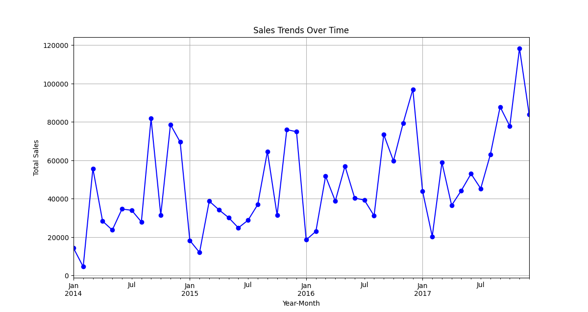
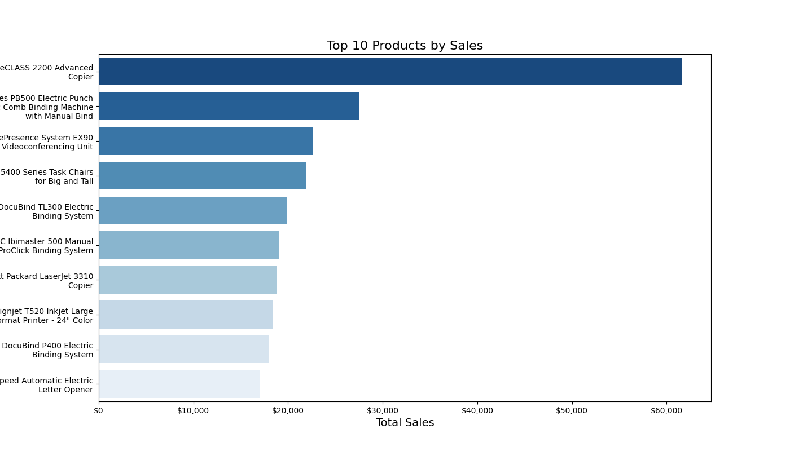
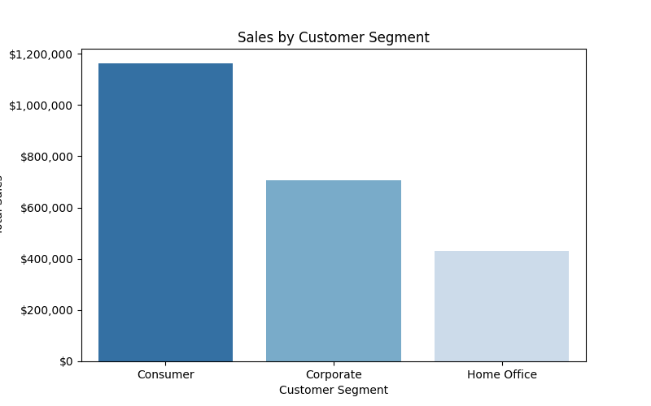
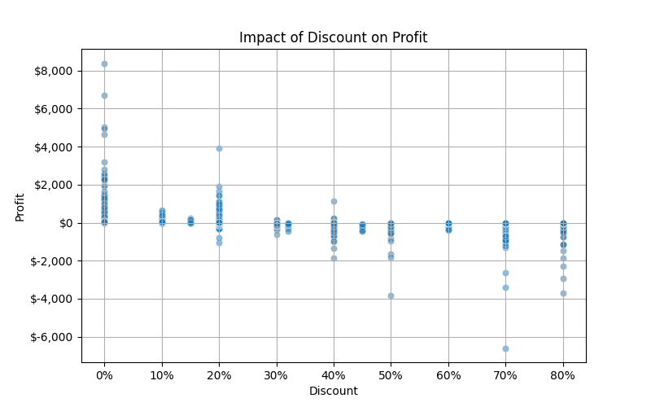
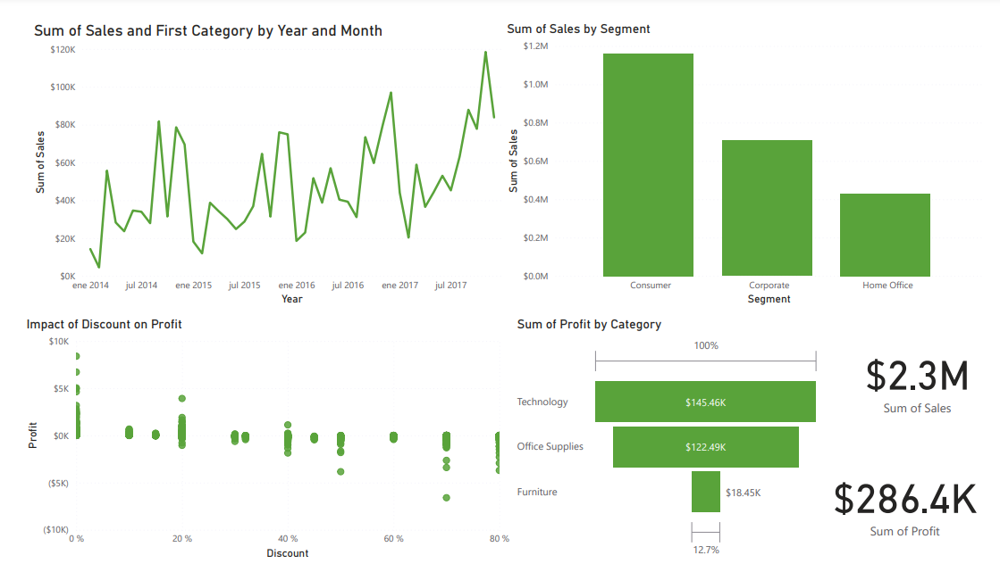

**Introduction**

In today\'s competitive retail landscape, businesses must continuously
analyze their sales performance, customer behavior, and profitability to
make informed decisions. This case study explores the sales trends,
customer segmentation, and profitability of a retail company using
transactional data.

The objective is to help executives understand key performance patterns,
identify opportunities for revenue growth, and improve strategic
decision-making. The dataset, "Sample - Superstore.csv," represents a
retail business with various product categories, customer segments, and
regional sales data.

**Real World Relevance**

Retail companies face challenges in optimizing their sales strategies,
understanding customer needs, and maximizing profitability. By analyzing
historical sales data, businesses can:

- Identify seasonal trends and adjust inventory.

- Segment customers for targeted marketing.

- Assess the impact of discounts on profitability.

- Determine which products and regions drive the most revenue.

**Assumptions & Theories**

- Sales follow seasonal patterns, meaning certain times of the year have
  higher revenue.

- Discounting strategies may impact profitability, with excessive
  discounts potentially leading to losses.

- Different customer segments have varying purchasing behaviors,
  affecting sales and profit distribution.

This study aims to validate these assumptions and provide data-driven
recommendations for better business performance.

**Ask- Guiding questions**

**What topic are you exploring?**

This study focuses on analyzing **sales trends, customer segmentation,
and profitability** in a retail business. The goal is to uncover
patterns that can help executives make data-driven decisions.

**What is the problem you are trying to solve?**

The business faces three key challenges:

1.  **Sales Trends** -- Sales are inconsistent over time, affecting
    revenue stability.

2.  **Customer Segmentation & Retention** -- Some customer segments
    contribute more to revenue than others, but there's no clear
    strategy for retention.

3.  **Profitability Concerns** -- Certain products and discounts reduce
    profit margins, and some orders result in financial losses.

**What metrics will you use to measure your data to achieve your
objective?**

To assess these challenges, the following metrics will be used:

- **Sales Metrics**: Total revenue, sales trends over time, sales by
  region/category.

- **Customer Metrics**: Purchase frequency, revenue per segment,
  customer retention rates.

- **Profitability Metrics**: Gross profit, profit margins by
  product/category, impact of discounts on profits.

**Who are the stakeholders?**

- **Company Executives** -- Need insights for strategic planning.

- **Sales & Marketing Teams** -- Require customer segmentation insights
  to optimize campaigns.

- **Finance Team** -- Interested in profitability analysis to improve
  financial performance.

- **Inventory & Supply Chain Managers** -- Need sales trend data to
  optimize inventory.

**Who is your audience?**

The **primary audience** is **company executives**, who require
high-level insights and actionable recommendations for decision-making.

**How can your insights help your client make decisions?**

By analyzing sales trends, customer segments, and profitability, the
company can:  
✅ Improve **sales forecasting** and optimize inventory levels.  
✅ Develop **targeted marketing strategies** for different customer
segments.  
✅ Adjust **discount strategies** to maximize profit while maintaining
customer loyalty.  
✅ Identify **high-value customers** and create personalized retention
programs.  
✅ Focus on **high-profit products** while minimizing loss-making
transactions.

**Prepare the data**

I decided to use a public dataset from Kaggle as part of the project.
The data is a csv file extracted from
<https://www.kaggle.com/datasets/vivek468/superstore-dataset-final>

The data consists of **9,994 rows and 21 columns**, including:

- **Order Details**: Order ID, Order Date, Ship Date, Ship Mode.

- **Customer Information**: Customer ID, Customer Name, Segment, Region.

- **Product Details**: Product ID, Category, Sub-Category, Product Name.

- **Financial Metrics**: Sales, Quantity, Discount, Profit.

To assess credibility, we apply the **ROCCC framework**:  
**Reliable**: The data appears to be from an internal sales system, but
its source is unknown. If it's a sample dataset, it may not fully
reflect real-world conditions.  
**Original**: It seems like first-party data collected by the company.  
**Comprehensive**: The dataset includes key details for sales analysis
but lacks external factors (e.g., market trends).  
**Current**: The timeframe of the data is unclear. If it's outdated,
insights may not be applicable today.  
**Cited**: Since this dataset is commonly used for practice, its
original source isn\'t explicitly cited.

Data may not represent **all retail industries**---it reflects only one
company's sales.

Missing external factors like **seasonality, competitors, and economic
conditions** may affect findings. This dataset is widely used for
practice, so **licensing is assumed to be open**. There are **no
personally identifiable details** beyond customer names. In real-world
cases, this data should be anonymized. Since the dataset is in **CSV
format**, it is **easily accessible** for analysis.

Data integrity vas addresed by:

- Checked for **missing values** (none found).

- Converted **date columns** to ensure correct formatting.

- Reviewed **summary statistics** to detect inconsistencies (e.g.,
  negative profits, high discounts).

- Cross-checked sales, profit, and discount values for **logical
  accuracy**.

**Process the data**

For this case study, we use the following tools:

**[Python]{.underline} (Pandas, Matplotlib, Seaborn)** -- For **data
manipulation, cleaning, and visualization**.  
**[Excel/Google Sheets]{.underline}** -- Useful for **quick data
exploration**  
**[Power BI]{.underline}**-- For creating **interactive dashboards**.

These tools are chosen because they provide **efficient, scalable**
methods for analyzing sales trends, customer segmentation, and
profitability.

Steps taken to ensure that your data is clean

1.  **Loaded the dataset** and checked for missing values.

2.  **Converted date columns** to proper datetime format.

3.  **Checked for duplicates** and found none.

4.  **Ensured numerical columns (Sales, Profit, Discount, Quantity) were
    in correct formats**.

5.  **Reviewed discount values** to ensure they are within a logical
    range (0% to 80%).

6.  **Scanned for outliers**, particularly **negative profit values**
    that might indicate loss-making transactions.

**Data Analysis**

Now that the data is cleaned and formatted, we conduct a structured
analysis to uncover insights related to sales trends, customer
segmentation, and profitability.

The data is structured into three key analytical segments:

1.  Sales Trends Analysis -- Aggregating sales data by time period,
    region, and product category.

2.  Customer Segmentation -- Grouping customers by segment and purchase
    behavior.

3.  Profitability Analysis -- Evaluating profit margins, discount
    impact, and product performance.

**Dates** formatted to allow time-based trend analysis. **Numeric values
(Sales, Profit, Discount, Quantity)** correctly formatted for
calculations. **Categorical variables (Regions, Segments, Product
Categories)** structured for grouping and filtering.

**Insights discovered in the data**

**🔹** Discounting affects profitability significantly -- Some
high-discount orders resulted in negative profits.  
🔹 Certain regions underperform -- Despite high sales in some areas,
profit margins remain low.  
🔹 A small segment of customers drive most revenue -- A subset of
customers contributes disproportionately to total sales.

**📊 Sales Trends Analysis**

- Sales fluctuate, with peak months likely indicating **seasonal
  demand**.

- Certain product categories (e.g., **Technology**) contribute the
  highest revenue.

- Some **regions perform better** in sales but struggle with
  profitability.

> 

**🎯 Customer Segmentation Analysis**

- **Corporate customers generate higher average revenue** than
  individual consumers.

- **Loyal customers contribute significantly to total sales**,
  suggesting a need for retention strategies.

**💰 Profitability Insights**

- **High discounts reduce profitability**, especially in **Furniture and
  Office Supplies**.

- Some **products are loss-making** despite high sales.

- Orders with **higher quantities tend to be more profitable**,
  suggesting bundling strategies could be effective.

**How will these insights help answer your business questions?**

✅ Helps **optimize inventory** by focusing on profitable products.  
✅ Guides **marketing strategies** by targeting high-value customers.  
✅ Suggests adjustments in **discounting policies** to improve profit
margins.

**Visualization of data**

The analysis provided insights into sales trends, customer segmentation,
and profitability. The data helped identify seasonal trends, high-value
customers, and the impact of discounts on profit margins.

**What story does your data tell?**

- Sales fluctuate throughout the year, indicating seasonal demand.

- A small group of customers contributes significantly to total revenue.

- High discount rates negatively impact profitability, especially in
  specific product categories.

- Some regions generate high sales but struggle with low profit margins.

The insights directly address the three business challenges:

✅ Sales trends highlight when demand peaks and which categories perform
best.

✅ Customer segmentation reveals which segments are most valuable for
retention strategies.

✅ Profitability analysis identifies which discounts harm margins and
which products are most profitable.

The primary audience includes company executives, sales and marketing
teams, and finance teams.

The best way to communicate is through clear and visually appealing data
visualizations that present key insights concisely. **Dashboards** will
make the findings more engaging and easier to understand.

**FINAL CONCLUSION**

Our analysis uncovered key insights into sales trends, customer
segmentation, and profitability. The major takeaways are:  
✅ Sales Trends: Sales fluctuate seasonally, and certain months show
peak demand.  
✅ Customer Segmentation: A small group of high-value customers
contributes significantly to total revenue.  
✅ Profitability: High discount rates negatively impact profit margins,
particularly in the Furniture and Office Supplies categories.  
✅ Regional Performance: Some regions generate high sales but have low
profitability due to discounting strategies.

How Can the Business Apply These Insights?

- Optimize Inventory Management 📦: Stock more high-performing products
  and adjust supply levels based on seasonal trends.

- Refine Discount Strategies 🎯: Reduce excessive discounting,
  especially for low-profit categories.

- Enhance Customer Retention Programs 💡: Focus on high-value customers
  with loyalty incentives and personalized offers.

- Improve Regional Sales Strategies 🌍: Target underperforming regions
  with better pricing and marketing strategies.

Next Steps for Stakeholders

🔹 Executives: Use insights for strategic decision-making on pricing,
promotions, and growth areas.  
🔹 Marketing Team: Develop customer segmentation-based campaigns and
retention programs.  
🔹 Sales Team: Focus on selling high-profit items and upselling to
high-value customers.  
🔹 Finance Team: Adjust discounting policies to improve overall
profitability.

Additional Data to Expand Findings

📊 External Market Data: Compare against industry benchmarks to assess
competitiveness.  
🛒 Customer Satisfaction Surveys: Gather qualitative insights on why
customers buy or leave.  
📅 Seasonality & Economic Trends: Include economic factors to refine
forecasting models.
