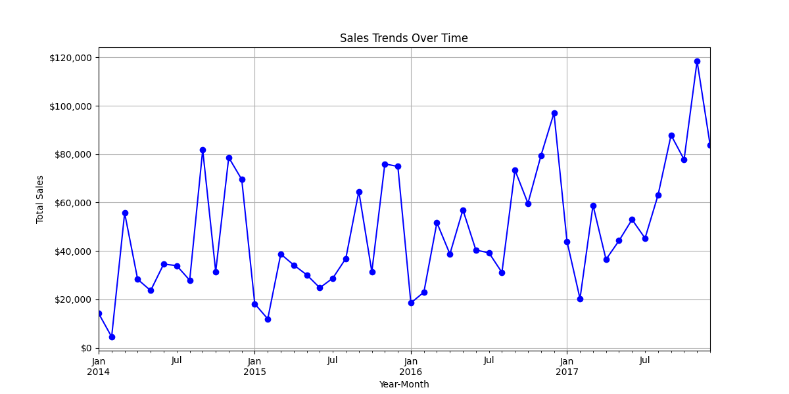

# **Retail Sales Data Analysis - Superstore Case Study**

## **📌 Introduction**
In today's competitive retail industry, businesses must continuously analyze their sales performance, customer behavior, and profitability to make **data-driven decisions**. This case study explores **sales trends, customer segmentation, and profitability** using transactional data from a retail company.

### **🎯 Objectives**
This analysis helps executives:
✅ Identify **key performance trends** in sales.  
✅ Discover **high-value customers** and improve retention strategies.  
✅ Assess the **impact of discounts** on profitability.  
✅ Understand **regional and product-wise** profitability.  

The dataset, "Sample - Superstore.csv," contains information on sales transactions, customer segments, and regional sales data.

---

## **📊 Business Challenges**
### **1️⃣ Sales Trends & Stability**
- Sales fluctuate over time, affecting **revenue predictability**.
- Identifying **seasonal patterns** can improve inventory planning.

### **2️⃣ Customer Segmentation & Retention**
- Some customer groups contribute more to revenue than others.
- Understanding customer behavior can drive **targeted marketing**.

### **3️⃣ Profitability & Discount Strategies**
- Some products are **low-profit despite high sales**.
- High discounts may lead to **negative profit margins**.
- Regional differences impact **sales and profitability**.

---

## **📏 Key Metrics**
To address these challenges, we analyze:

🔹 **Sales Metrics**: Revenue, monthly trends, sales by region & category.  
🔹 **Customer Metrics**: Purchase frequency, revenue per segment, customer retention.  
🔹 **Profitability Metrics**: Gross profit, profit margins by category, impact of discounts.

---

## **🛠 Data Preparation**
### **📂 Dataset Overview**
- **Source**: Public dataset from Kaggle ([Superstore Dataset](https://www.kaggle.com/datasets/vivek468/superstore-dataset-final)).
- **Size**: **9,994 rows** and **21 columns**.
- **Key Features**:
  - **Order Details**: Order ID, Order Date, Ship Date, Ship Mode.
  - **Customer Info**: Customer ID, Segment, Region.
  - **Product Details**: Product ID, Category, Sub-Category, Product Name.
  - **Financial Metrics**: Sales, Quantity, Discount, Profit.

### **🔍 Data Cleaning & Integrity**
- **Converted** date columns to ensure proper time-based analysis.
- **Checked for missing values & duplicates** (none found).
- **Ensured numerical columns** (Sales, Profit, Discount, Quantity) were correctly formatted.
- **Verified discounts** were within logical bounds (0% to 80%).
- **Scanned for outliers**, such as negative profits.

---

## **📈 Data Analysis & Insights**
### **📊 1. Sales Trends Analysis**
🔹 Sales fluctuate over time, showing **seasonal demand trends**.  
🔹 **Technology** products contribute the most to revenue.  
🔹 Some **regions generate high sales but struggle with low profitability**.

  
  

### **🎯 2. Customer Segmentation Insights**
🔹 **Corporate clients** generate higher revenue than individuals.  
🔹 A small segment of customers drives a **large share of sales**.  
🔹 **Loyalty programs** can help retain high-value customers.

### **💰 3. Profitability & Discount Analysis**
🔹 High **discounts significantly reduce profit margins**.  
🔹 Some **products have negative profit despite high sales**.  
🔹 Orders with **higher quantities tend to be more profitable** (suggesting bundling strategies could help).

### **🌍 4. Regional Performance**
🔹 Certain **regions underperform in profitability despite high sales**.  
🔹 Adjusting pricing or marketing strategies could improve results.

---

## **📊 Visualizations & Dashboards**
To communicate findings effectively, we used:
✅ **Power BI Dashboards** - Interactive visuals for deeper exploration.  
✅ **Python Charts (Matplotlib & Seaborn)** - Line, bar, and scatter plots for key insights.  

🔹 **Key Visuals:**
- **Sales trends over time** (line chart).  
- **Customer segmentation & revenue contribution** (bar chart).  
- **Impact of discounts on profits** (scatter plot).  
- **Profitability by region & category** (heatmap).

📌 **Refer to:** `dashboard_superstore.pbix` for interactive analysis.

---

## **📌 Actionable Recommendations**
### **🔹 1. Improve Inventory & Sales Forecasting**
✅ Stock **high-demand products** based on seasonal trends.  
✅ Reduce inventory for **low-profit items**.  

### **🔹 2. Optimize Discount Strategies**
✅ Identify the **ideal discount range** that maximizes sales **without hurting profits**.  
✅ Reduce **excessive discounts** on low-margin products.

### **🔹 3. Strengthen Customer Retention & Targeting**
✅ Offer **personalized marketing** for high-value customers.  
✅ Implement **loyalty programs** for top spenders.  

### **🔹 4. Region-Specific Strategies**
✅ Adjust **pricing and promotions** based on regional performance.  
✅ Focus on **profitable regions** while improving underperforming ones.

---

## **🛠 Tools Used**
📌 **Python** (Pandas, Matplotlib, Seaborn) - Data Cleaning & Analysis  
📌 **Power BI** - Interactive Dashboard Creation  
📌 **Excel/Google Sheets** - Quick Data Exploration  

---

## **🚀 Next Steps**
🔹 **Expand external data sources** (e.g., economic factors, competitor pricing).  
🔹 **Include seasonality & trend forecasting** (moving averages).  
🔹 **Enhance segmentation with purchase behavior clustering**.  

---

## **📞 Contact & Collaboration**
For questions or further collaboration, feel free to reach out! 😊

